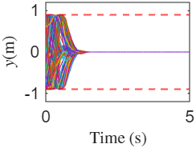
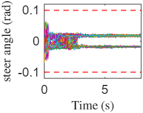
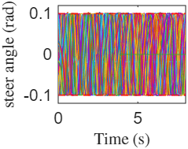
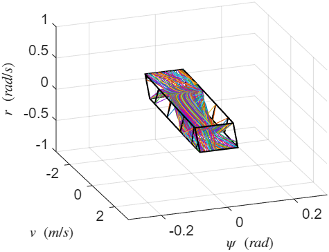
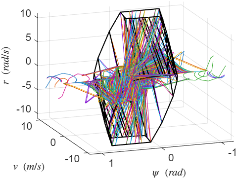
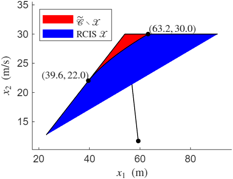
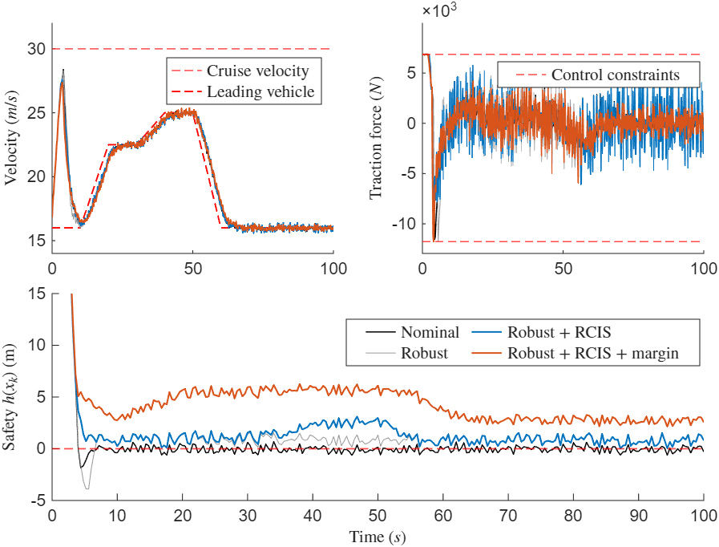

# identification-free-control-sim
## Overview
This repository contains the MATLAB/Simulink simulation code accompanying our paper **“Data-Driven Control Based on Control Barrier Functions with Recursive Feasibility Guarantee.”**
It implements an identification-free, data-driven safety-critical control framework that embeds control barrier function (CBF) constraints into an online CLF–CBF quadratic program, while enforcing recursive feasibility via data-driven (robust) control-invariant set constraints under state/input limits.
The repository includes two case studies: lane keeping (LK) and adaptive cruise control (ACC).

## Repository contents
```text
.
├─ LK_demo.mlx                 # Lane-keeping (LK) main demo: runs all LK simulations and generates plots (calls LK_sim.slx)
├─ LK_sim.slx                  # LK Simulink model (invoked by LK_demo.mlx)
├─ LK_draw.mlx                 # Post-processing for LK: generates solve timings and figures and exports EPS (invoked by LK_demo.mlx)
├─ ACC_demo.mlx                # Adaptive cruise control (ACC) main demo: runs all ACC simulations and generates plots (calls ACC_Sample.slx, ACC_sim.slx)
├─ ACC_Sample.slx              # ACC data-collection/sampling Simulink model (invoked by ACC_demo.mlx)
├─ ACC_sim.slx                 # ACC closed-loop Simulink model (invoked by ACC_demo.mlx)
├─ ACC_draw.mlx                # Post-processing for ACC: generates solve timings and figures and exports EPS (invoked by ACC_demo.mlx)
├─ reoportEnvironment.mlx      # Reports software/hardware, solvers, and toolbox dependencies (update file paths before running)
├─ Figures/                    # Exported EPS figures
├─ AlgorithmCIS.m              # Algorithm 1: identification-free, data-driven CIS construction within a given set
├─ EstimateUncertaintyBoundsFromData.m  # Data-driven uncertainty bound estimation (as in the paper)
├─ VerifyRCIS.m                # Verifies whether a candidate set is an RCIS
├─ ControlAlgorithm1.m         # Control Algorithm 1: builds the online CLF–CBF QP optimizer (used in LK_sim)
├─ ControlAlgorithm2.m         # Control Algorithm 2: builds the online robust CLF–CBF QP optimizer (used in ACC_sim)
├─ LK_data.mat                 # Saved LK simulation data (generated by LK_demo; can be loaded to run LK_draw.mlx directly)
├─ ACC_data.mat                # Saved ACC simulation data (generated by ACC_demo; can be loaded to run ACC_draw.mlx directly)
├─ EnvirInfo.mat               # Output of reoportEnvironment.mlx (software/hardware info as strings)
├─ slprj/                      # (auto-generated) Simulink build cache (optional; can be deleted)
├─ *.slxc                      # (auto-generated) Simulink cache files (optional; can be deleted)
└─ README.md
````

> **Notes**
>
> * `slprj/` and `*.slxc` are auto-generated by Simulink and are not required to reproduce the results.
> * Other cache/build artifacts can be safely ignored.

## Quick start

### Lane keeping (LK)
1. Open `LK_demo.mlx` and run all sections.
2. The script calls `LK_sim.slx` and `LK_draw.mlx`, and exports EPS figures to `Figures/`.
3. (Optional) To regenerate figures without rerunning Simulink, load `LK_data.mat` and run `LK_draw.mlx`.

### Adaptive cruise control (ACC)
1. Open `ACC_demo.mlx` and run all sections.
2. The script calls `ACC_Sample.slx`, `ACC_sim.slx`, and `ACC_draw.mlx`, and exports EPS figures to `Figures/`.
3. (Optional) To regenerate figures without rerunning Simulink, load `ACC_data.mat` and run `ACC_draw.mlx`.
> Notes:
> -Simulation data files (`LK_data.mat`, `ACC_data.mat`) are **saved manually** and are **not automatically overwritten** by running `LK_demo.mlx` / `ACC_demo.mlx`.

## Tested environment

The code has been tested with the following environment:

- **OS:** Windows Microsoft Windows 11 Pro (Windows 11 Pro)
- **CPU:** 12th Gen Intel(R) Core(TM) i7-12700KF (12 cores)
- **MATLAB:** MATLAB 25.1.0.2973910 (R2025a) Update 1
- **Solvers/Libraries:** MOSEK 11.0.14 (Build date: 2025-04-03); YALMIP 20250626; MPT3 3.2.1
- **MATLAB toolboxes (required by LK_demo + LK_sim):** Control System Toolbox; Simulink
- **MATLAB toolboxes (required by ACC_demo + ACC_Sample + ACC_sim):** Automated Driving Toolbox; Simulink

> Notes:
> - MOSEK requires a valid license.

## Features

> **GitHub preview note:** GitHub does not render `.eps` files in README.  
> This repository provides **PNG** copies under `Figures/` for preview, while the **EPS** versions are used for the paper.

### Lane-Keeping (LK): Effect of the Control Invariant Set (CIS)

**What to look for:** Adding the CIS constraint enforces **recursive feasibility** and keeps the lateral position within lane bounds under the same vertex-initialized tests; without the CIS constraint, some trajectories can violate the lane envelope even when the steering input remains within limits.

**(1) Lateral displacement and steering angle (Case 1: with CIS, Case 2: without CIS)**

<table align="center">
  <tr>
    <td align="center">
      <br>
      <b>Case 1 (with CIS): Lateral displacement</b>
    </td>
    <td align="center">
      <br>
      <b>Case 1 (with CIS): Steering angle</b>
    </td>
  </tr>
  <tr>
    <td align="center">
      <br>
      <b>Case 2 (no CIS): Lateral displacement</b>
    </td>
    <td align="center">
      <br>
      <b>Case 2 (no CIS): Steering angle</b>
    </td>
  </tr>
</table>

**(2) State evolution in the (v, psi, r) subspace (projection view for intuition)**  
The black polyhedron depicts the projection of the computed CIS; colored curves are trajectories initialized at its vertices.

<table align="center">
  <tr>
    <td align="center">
      <br>
      <b>With CIS: trajectories remain inside the projected CIS</b>
    </td>
    <td align="center">
      <br>
      <b>Without CIS: trajectories can exit the projected region</b>
    </td>
  </tr>
</table>

---

### Adaptive Cruise Control (ACC): Robustness + RCIS + Safety Margin

**What to look for:**  
- The RCIS is computed inside a truncated safety set and certified robust under the full actuator range (with a reserved braking margin during construction).  
- In closed-loop simulations, adding **RCIS constraints** prevents feasibility loss that can lead to safety violations; adding a **positive margin** further increases the safety buffer.

**(1) RCIS and iteration outcome**

<p align="center">
  <br>
  <b>RCIS (blue) inside the truncated safety set (red)</b>
</p>

**(2) Closed-loop responses (velocity, traction force, and safety function)**  
Comparison of four controllers: nominal baseline, robust-only, robust + RCIS, robust + RCIS + margin.

<p align="center">
  <br>
  <b>Closed-loop ACC trajectories and safety evolution under four controller configurations</b>
</p>

---

## **Additional Information**
If you encounter any issues, please check the respective toolbox documentation or contact the authors for assistance.
